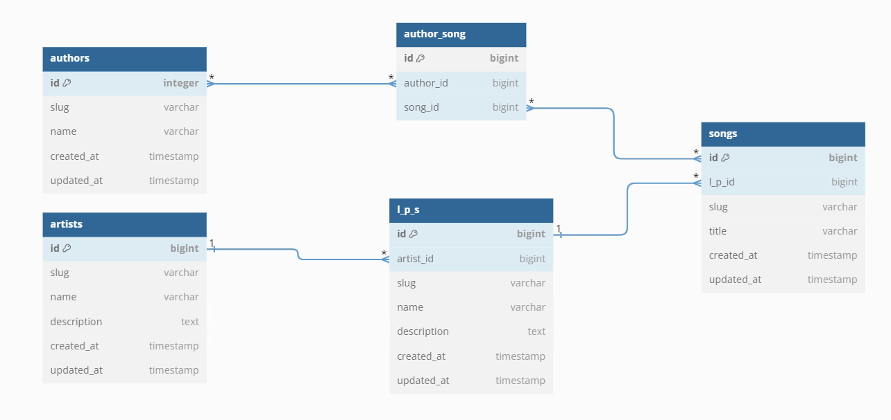

# Discography Project

This application is a simple website to manage the database of musical records from a discography firm.

In this application, you will be able to manage the following:

- View a report of LPs or artists.
- View a list of artists with their respective information.
- View a list of LPs with their respective information.
- You will be able to add, edit, and delete artists. Note: In the case of deleting an artist, their respective LPs, songs and authors will also be deleted.
- You will be able to add, edit, and delete LPs. Note: In the case of deleting an LP, their respective songs and authors will also be deleted.

Each list (reports, artists, and LPs) is displayed using Bootstrap DataTables.
For the list of artists and LPs, AJAX requests are used to perform add, edit, and delete operations. This approach provides the advantages of filtering and paginating results and avoids reloading the web page every time an operation (add, edit, or delete) is performed.

## Database diagram

- Models: Artist, LP, Song, Author
- Associations:
  * Artist and LP is one to many, one Artist has many LPs, and one LP belongs to one Artist.
  * One LP has many songs.
  * One song belongs to many Authors and one Author has many Songs.



## Getting Started

These instructions will help you get a copy of the project up and running on your local machine for development and testing purposes.

### Prerequisites

- [PHP >= 8.1](http://php.net/)
- [Composer](https://getcomposer.org/)
- [Git](https://git-scm.com/)
- For the database, SQLite3 has been used.


### Installation

1. Clone this repository into your directory:

    ````
    git clone https://github.com/maa5/discography.git
    ````

2. Navigate into your application directory:
   
    ````    
    cd <your path>
    ````

3. Run composer for install dependencies:

    ````
    composer install
    ````

4. Run npm for install dependencies:

    ````
    npm install
    ````

5. SQLite Configuration: Create a new SQLite database: create file `database.sqlite` into `database` directory.

6. Create the `.env` file by copying from the example provided (`.env.example`):

    ```
    cp .env.example .env
    ```

7. Create your Encryption Key. (This generate `APP_KEY` value in `.env` file):

    ```
    php artisan key:generate
    ```

8. Modify the `.env` file with your desired local environment configuration options. After the database has been created, set your environment variable to point to this database by placing the absolute path to the database in the `DB_DATABASE` environment variable:

    ```
    DB_CONNECTION=sqlite
    DB_DATABASE=/absolute/path/to/database.sqlite
    ```

9. Create your database tables (this will run the migrations located in `/discography/database/migrations/`):

    ```
    php artisan migrate
    ```

10. Populate your database tables (this will populate your tables with fake data coming form `/discography/database/seeds`):

    ````
    php artisan db:seed
    ````

11. Run the following command:

    ```
    npm run build
    ```

12. Run your server:

   ````
   php artisan serve
   ````

13. Open your browser and go to `http://127.0.0.1:8000`

## Testing

In the tests directory, you will find the tests to verify the application.

1. Before running the tests, let's set up a testing database. Create a new SQLite database testing: create file `databasetesting.sqlite` into `database` directory.

2. Create the `.env.testing` file by copying from the example provided (`.env`):

    ```
    cp .env .env.testing
    ```

3. Modify the `.env.testing` file with your desired local environment configuration options. After the testing database has been created, set your environment variables to point to this testing database by placing the absolute path to the database in the `DB_DATABASE` environment variable:

    ```
    DB_CONNECTION=sqlite
    DB_DATABASE=/absolute/path/to/databasetesting.sqlite
    ```

4. Create your database testing tables (this will run the migrations located in `/discography/database/migrations/`). Important: Specify the testing environment variables file using the following command (--env=testing):

    ```
    php artisan migrate --env=testing
    ```

5. Run the tests:

    ```
    php artisan test
    ```

## Built With

- [Visual Studio Code](https://code.visualstudio.com/)
- [PHP >= 8.1](http://php.net/)
- [Laravel 10](https://laravel.com/)
- [jQuery DataTables bootstrap4](https://datatables.net/examples/styling/bootstrap4)
- [Laravel DataTables](https://yajrabox.com/docs/laravel-datatables/10.0)
- [Composer](https://getcomposer.org/)
- [Vite](https://es.vitejs.dev/)
- [Sass](https://sass-lang.com/)

## Author

**Mohamed Aziz** - [Github](https://github.com/maa5)